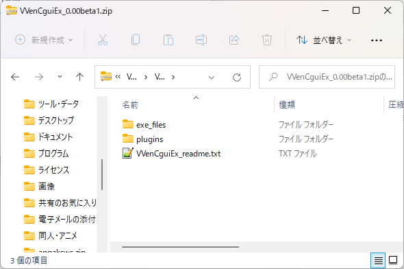
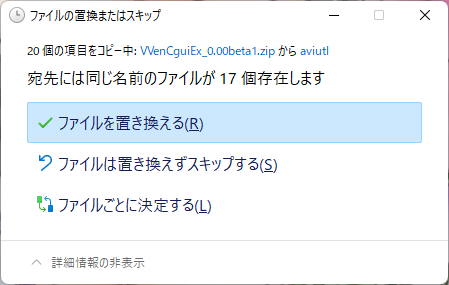
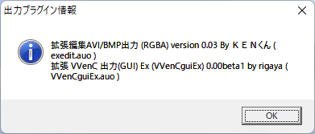
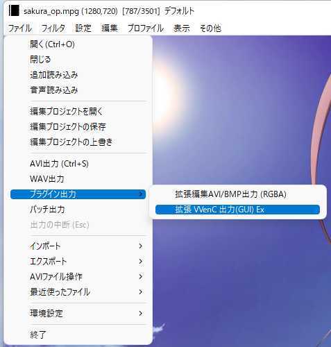
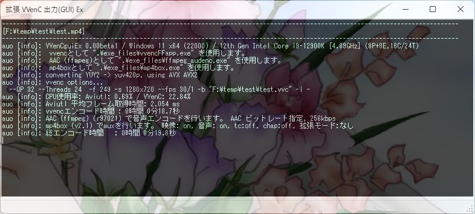
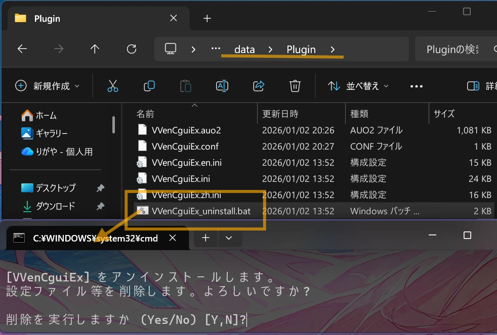

# 拡張 VVenC 出力(GUI) Ex  
by rigaya  

拡張 VVenC 出力(GUI) Ex (VVenCguiEx) は、[VVenC](https://github.com/fraunhoferhhi/vvenc)を使用してエンコードを行うAviutlの出力プラグインです。

## ダウンロード & 更新履歴
[こちら＞＞](https://github.com/rigaya/VVenCguiEx/releases)

## 想定動作環境
Windows 10/11 (x64)  
Aviutl 1.00 以降 推奨

x86(32bit)環境では動作しません。

## VVenCguiEx 使用にあたっての注意事項
無保証です。自己責任で使用してください。  
拡張 VVenC 出力(GUI) Exを使用したことによる、いかなる損害・トラブルについても責任を負いません。  

## VVenCguiEx の Aviutl への導入・更新

### ダウンロード

まず、VVenCguiExを[こちら](https://github.com/rigaya/VVenCguiEx/releases)からダウンロードします。

### 導入・更新

ダウンロードしたzipファイルをダブルクリックして開きます。中身はこんな感じです。



中身をすべてAviutlフォルダにコピーします。


更新時には、下記のように上書きするか聞いてくることがあります。

その場合には「ファイルを置き換える」を選択して上書きしてください。


  
  
  
このあとAviutlをダブルクリックして起動してください。

初回起動時に必要に応じて下の図のようにVVenCguiExの使用準備をするというメッセージが出ます。環境によっては準備が不要な場合があり、その場合は表示されません。

OKをクリックすると使用準備が開始されます。


  
  
  
下の図のように、「この不明な発行元からのアプリがデバイスに変更を加えることを許可しますか?」というメッセージが表示されますので、「はい」をクリックしてください。


  
  
  
下の図のようなウィンドウが表示され、VVenCguiExの使用に必要なモジュールがインストールされます。

エラーなくインストールが完了すると下記のように表示されますので、右上の[x]ボタンでウィンドウを閉じてください。


これで使用準備は完了です。

### 確認

VVenCguiExがAviutlに認識されているか確認します。

Aviutlの [その他] > [出力プラグイン情報]を選択します。


VVenCguiEx 0.xxが表示されていれば成功です。




### エンコード
[ ファイル ] > [ プラグイン出力 ] > [ 拡張 VVenC 出力 (GUI) Ex ] を選択し、出力ファイル名を入力して、「保存」をクリックしてください。



エンコードが開始されます。



エンコードが完了するまで待ちます。お疲れ様でした。


## 手順通り導入してもAviutlの出力プラグイン情報に表示されない場合

- 下記ファイルがコピー先のAviutlフォルダ内に存在するか確認してみてください。
  最低限下記ファイルが導入には必須です。まれにウイルス対策ソフト等により、削除されている場合があります。

  - Aviutlフォルダ
    - exe_files [フォルダ]
      - auo_setup(.exe)
      - auo_setup(.ini)
      - check_dotnet(.dll)
      - check_vc(.dll)
      - VC_redist.x86(.exe)

    - plugins [フォルダ]
      - auo_setup.auf
      - VVenCguiEx.auo
      - VVenCguiEx(.ini)
  
  - 上記ファイルが存在しない場合
    再度exe_filesフォルダとpluginsフォルダのコピーを行ってみてください。
    それでもファイルが消えてしまう場合は、ウイルス対策ソフトによってファイル削除がされていないかご確認ください。
    
  - 上記ファイルが存在するのにVVenCguiExが認識されない場合
    まずAviutlを終了したうえで、exe_filesフォルダ内のVC_redist.x86(.exe)をダブルクリックで実行してください。その後、再度Aviutlを起動し、再度確認してみてください。

## 多言語対応

現在、日本語、英語の切り替えに対応しています。

他の言語については、VVenCguiEx.auoと同じフォルダに下記2ファイルを置くことで、新たな言語を追加できます。

| ファイル名 | 翻訳元 |
|:---        |:---   |
| VVenCguiEx.<2文字の言語コード>.lng | VVenCguiEx.ja.lng |
| VVenCguiEx.<2文字の言語コード>.ini | VVenCguiEx.ja.ini |

いずれもUTF-8で保存してください。


## iniファイルによる拡張
VVenCguiEx.iniを書き換えることにより、音声エンコーダやmuxerのコマンドラインを変更できます。また音声エンコーダを追加することもできます。

デフォルトの設定では不十分だと思った場合は、iniファイルの音声やmuxerのコマンドラインを調整してみてください。

## VVenCguiEx の Aviutl からの削除

VVenCguiEx を Aviutl/AviUtl2 から削除するには、プラグインフォルダの ```VVenCguiEx_uninstall.bat``` をダブルクリックして実行します。



上記画面が表示されたら、```y``` と入力し、削除を実行してください。


## ソースコードについて
- MITライセンスです。

### ソースの構成
VCビルド  
文字コード: UTF-8-BOM  
改行: CRLF  
インデント: 空白x4  
